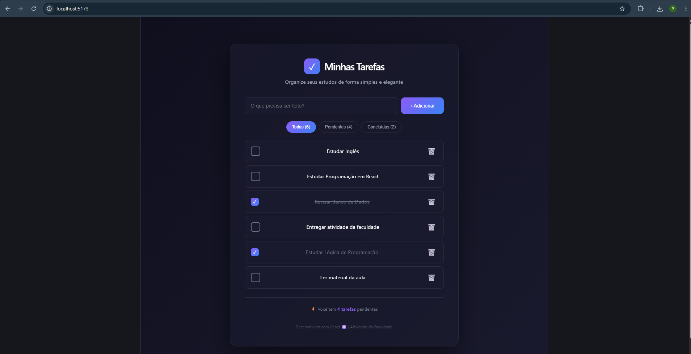

# 📝 Atividade React - Lista de Tarefas

Atividade desenvolvida para a disciplina da faculdade, utilizando **React** com **Vite**.

## 📋 Sobre o Projeto

Aplicação de Lista de Tarefas (To-Do List) com design moderno em dark mode.
Permite organizar tarefas de estudo de forma simples e elegante.

## ✨ Funcionalidades

- ✅ Adicionar novas tarefas
- ✅ Marcar tarefas como concluídas
- ✅ Remover tarefas
- ✅ Filtrar tarefas (Todas / Pendentes / Concluídas)
- ✅ Contador de tarefas pendentes
- ✅ Interface moderna com gradiente roxo/azul

## 🖼️ Print da Aplicação



## 🚀 Tecnologias Utilizadas

- React
- Vite
- JavaScript

## 💻 Como Executar o Projeto

```bash
npm install
npm run dev
```

---

Desenvolvido como atividade acadêmica 🎓
